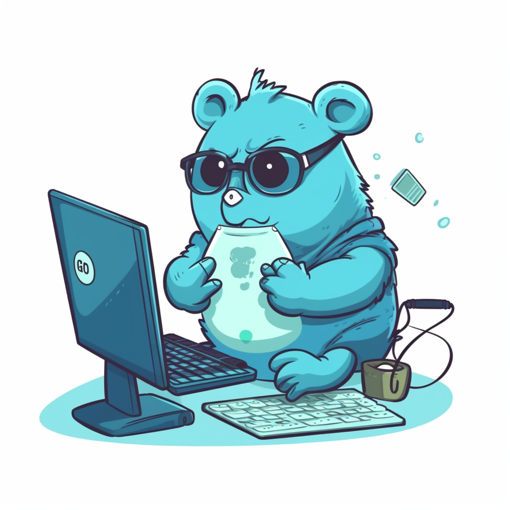

# Discord Golang bot

[](https://goreportcard.com/report/github.com/MiguelMachado-dev/disc-go-bot)

<p align="center">
  
</p>

Discord Golang bot is a simple Discord bot built using Golang, primarily for study purposes. The bot can respond to various commands and provide users with images of cats, dogs, and birds.

---

## Features

- Respond to `ping` command.
- Send a random cat image with the `meow` command.
- Send a random dog image with the `auau` command.
- Send a random bird image with the `birb` command.
- Periodically update a voice channel's name with the current number of Guilty Gear STRIVE players.

## Setup

To use this project, you need to follow these steps:

1. Clone the repository: `git clone https://github.com/MiguelMachado-dev/disc-go-bot.git`
2. Change directory to the cloned repository: `cd disc-go-bot`
3. Install the dependencies: `go mod download`
4. Create a .env file in the root directory of the project and add your Discord bot token: `DISCORD_BOT_TOKEN=your_bot_token`
5. Build the application: `go build`
6. Run the application: `./disc-go-bot`

Now, your bot should be running and connected to Discord. Invite the bot to your server and start using the commands.

## Usage
- `>ping`: The bot will respond with "Pong!"
- `>meow`: The bot will send a random cat image.
- `>auau`: The bot will send a random dog image.
- `>birb`: The bot will send a random bird image.

The bot will also automatically update the specified voice channel's name every few minutes (30 minutes as default) to display the current number of Guilty Gear players.

## Makefile Commands

The project includes a Makefile to help you manage common tasks more easily. Here's a list of the available commands and a brief description of what they do:

### Variables

- `APP_NAME`: The name of the application (default: `disc-go-bot`).
- `IMAGE_TAG`: The Docker image tag (default: `latest`).
- `DOCKERFILE_PATH`: The path to the Dockerfile (default: `Dockerfile`).
- `PORT`: The port on which the application will be exposed (default: `8080`).

### Targets

#### all (default)

- The default target, runs the `build` target.

#### build

- Builds the application using the Go compiler.

#### docker-build

- Builds the Docker image for the application using the specified Dockerfile.

#### docker-run

- Runs the application in a Docker container, exposing the specified port. This target depends on the `docker-build` target.

#### docker-stop

- Stops and removes the running Docker container.

#### clean

- Cleans up build artifacts by removing the generated executable.

#### test

- Executes the tests for the application using the Go test tool.

#### run

- Builds and runs the application locally.

To use the Makefile, simply run the desired target using the `make` command followed by the target name:

```bash
make build
```

## Used Tools

This project uses the following tools:

- [Golang](https://golang.org/) for backend development
- [DiscordGo](https://github.com/bwmarrin/discordgo) package that provides low level bindings to the Discord chat client API

## Contributing

To contribute to this project, please follow these guidelines:

1. Fork the repository
2. Create a new branch: `git checkout -b feature/your-feature-name`
3. Make your changes and commit them using Conventional Commits
4. Push to the branch: `git push origin feature/your-feature-name`
5. Submit a pull request

---

## License

This project is licensed under the MIT License - see the LICENSE.md file for details.

## Credits

This project was created by [MiguelMachado-dev](https://github.com/MiguelMachado-dev).